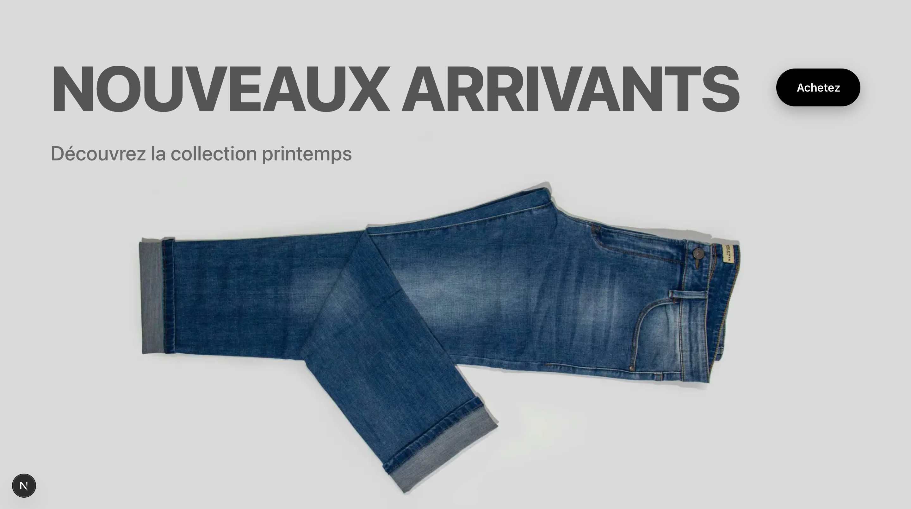
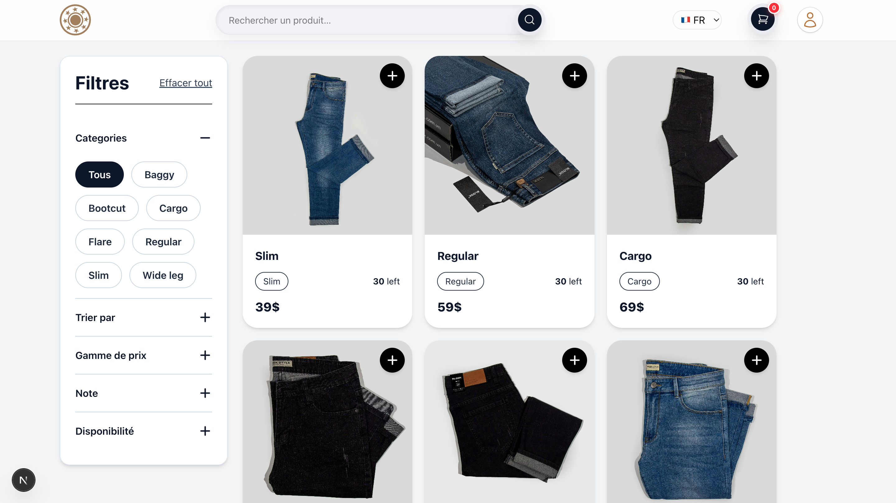
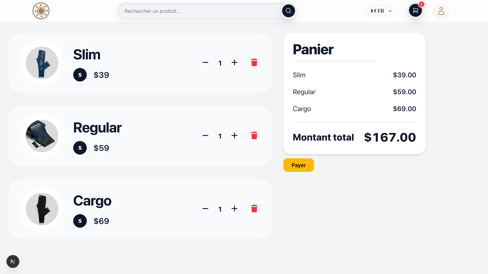

# Project
This project is inspired by the course Mastering NextJS with Interview Questions and E-commerce Project By : INIT Tech Labs.

# BlueJean Store Client

[](https://blue-jean-store-client.vercel.app/)
[](LICENSE)
[](https://nextjs.org/)

---

## 🧩 Overview

**BlueJean Store Client** is the frontend for an e-commerce portfolio project.
It showcases a modern, responsive online jeans store built with **Next.js** and **Tailwind CSS**.

Users can browse new arrivals, filter products by type, manage their cart, and proceed to checkout — all within a clean, fast, and mobile-friendly UI.

---

## ✨ Features

- 🏠 **Landing page** with hero banner & new arrivals
- 🔍 **Product filtering & search** (by type, categories, etc.)
- 🛒 **Shopping cart** with quantity management
- 🔑 **Authentication** (register / login forms with validation & error handling)
- 📱 **Responsive design** optimized for mobile and desktop
- ⚡ **Performance optimized** with static rendering and lazy loading for images

---

## 🛠 Tech Stack

- **Framework**: [Next.js 14](https://nextjs.org/) with App Router
- **Styling**: [Tailwind CSS](https://tailwindcss.com/)
- **Components**: Custom UI
- **State / Data fetching**: Server Components, Suspense, and caching strategies
- **Images**: `next/image` with WebP & lazy-loading
- **Deployment**: [Vercel](https://vercel.com/)

---

## 📸 Screenshots





---

## 🚀 Getting Started

Clone the repo and run locally:

```bash
git clone https://github.com/01-Codex/blueJean-Store-Client.git
cd blueJean-Store-Client

npm install

npm run dev
```